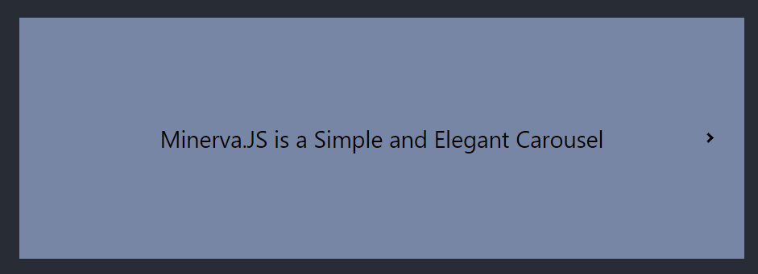

# Minerva.js

Minerva.JS is a Simple and Elegant Carousel Slider, and Minerva JS is a super lightweight carousel component. Written under the react framework.

Data:
We populate each slider and build a slider via a configuration that we will pass through the properties once invoked.

Types of Content:
There are two types of content at this moment. The first method is text-based; You can pass data via text. The second method is using an Image Url/Link.


The text content will display in the center of the slider. The Image will take the "full" width of the overall slider container.


### Installation

You can install the library through `npm ` or download the zip file and install it on your root folder.

### Usage

Verify that the library is installed, and ready to use. The next step is to import it to your React Project;

`import { Carousel } from "@misterzik/minerva.js/carousel";`

### Initialize The Component

Initialize the component wrapper by using;

```
<Carousel
  data={[]}
  controls={{}}
  widthSize={"500px"}
  heightSize={"300px"}
  duration={"30"}
/>
```

### Application Properties Interface

`data`: It's used to propagate and build the slider.

```
[
  {
    alt: "Minerva JS Plugin", // Alt Context
    textContent: true, // Enable Text Content Profile
    text: "Simple and Elegant Carousel", // Show Text Content Profile
    style: "mn-it", // Custom Style
  }
]
```

`controls`: It's used to display arrows within your sliders and enable Auto Slide.

```
{ 
  enabled: true, 
  styled: "arrows", 
  customStyle: "" 
}
```

`widthSize`: It's used to give the container the width size. Pass pixel or %.

`heightSize`: It's used to give the container the height size. Pass pixel or %.

`duration`: It's used to give the duration of each slider when using Auto Slide. Pass in seconds a `number` only;

```
10 seconds = 10
20 seconds = 20
30 seconds = 30
```

EX: `duration={20}`

More info - http://misterzik.github.io/minerva.js/
